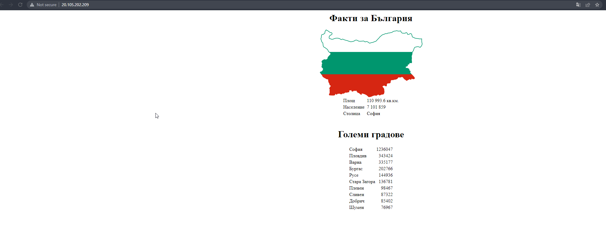

# Steps Solution Task 2

Solution 2 rellies on Azure, so you must be able to create your own service principle and fill it out in the terraform.tfvars file.

1. Fill out Azure SP for provider

In order to do that you must edit the following variables inside terraform.tfvars file:

```
subscription_id = "insert-guid-subscription-id"
tenant_id       = "insert-guid-tenant-id"
client_id       = "insert-guid-client-id"
client_secret   = "insert-string-client-secret"
```

2. Initialize and Apply terraform

```
terraform init
terraform apply -auto-approve
```

We wait for the apply to complete, once it's done the output should look like:

```
Apply complete! Resources: 15 added, 0 changed, 0 destroyed.

Outputs:

database_public_ip = "http://20.86.102.249"
vms_private_ips = [
  "10.0.2.5",
  "10.0.2.4",
]
webserver_public_ip = "http://20.105.202.209"
```

Afterward we could just enter the webserver public IP and we should see something like:


